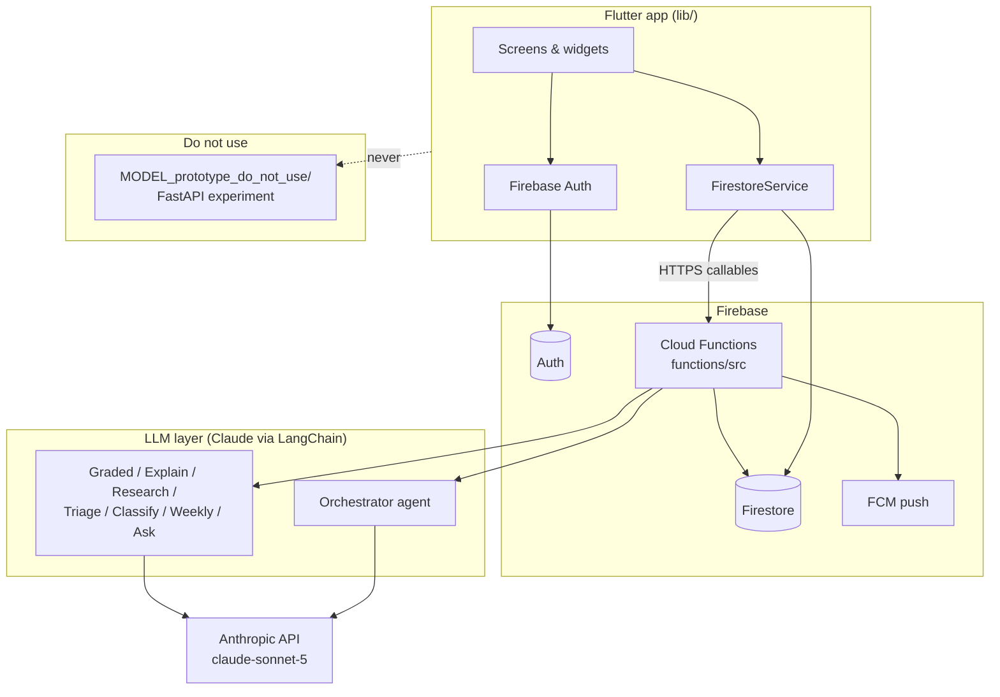

# AthleteIQ — Architecture (5-minute overview)

AthleteIQ is a Flutter app backed by **Firebase Cloud Functions** and **Firestore**. The phone talks to Firebase Auth and Firestore directly for most reads/writes; anything that needs secrets, LLMs, or cross-user logic runs in `functions/`.

> **Not in production:** `MODEL_prototype_do_not_use/` (formerly `MODEL/`) is an archived Python/FastAPI prototype. The live app never calls it. All server logic is in `functions/`.

---

## System diagram



---

## What runs where

| Layer | Location | Role |
|--------|-----------|------|
| **UI** | `lib/screens/`, `lib/widgets/` | Athlete home, check-in, coach roster/dashboard, Ask AthleteIQ, etc. |
| **Client data** | `lib/services/firestore_service.dart` | Firestore reads/writes, callable wrappers (`recalculateRisk`, `askAthleteIQ`, …) |
| **Models** | `lib/models/` | Dart types mirroring Firestore documents |
| **Backend** | `functions/src/` | Risk pipeline, LLM calls, privacy views, alerts, account deletion |
| **Rules** | `firestore.rules` | Who can read/write which paths (athlete vs coach vs server-only) |
| **Data** | Firestore | Single source of truth for profiles, check-ins, risk, chat, alerts |

Compiled JS lives in `functions/lib/` after `npm run build`; Firebase deploys from there.

---

## Request flow (typical check-in)

1. Athlete saves a check-in → `athletes/{uid}/checkins/{yyyy-mm-dd}` (client write).
2. App calls **`recalculateRisk`** (callable).
3. **`runRiskPipeline`** (`riskPipeline.ts`):
   - Loads last ~35 days of check-ins.
   - **`assessRisk`** (`riskModel.ts` + `calculations.ts`) — rule-based LOW/MEDIUM/HIGH (ACWR, recovery, fatigue). **This is the source of truth for risk level.**
   - Optional LLM steps enrich output (explain prose, orchestrator action, graded options, research note).
   - Writes **`riskResults/latest`** (coach sees full detail, status **`pending`**) and **`riskResults/athleteView`** (filtered copy for the athlete — **no recommendation text until approved**).
4. Coach approves on dashboard → client updates `latest` with `recommendationStatus: approved | modified`.
5. Server trigger refreshes **`athleteView`** so the athlete sees the released plan.

---

## Firestore (main collections)

```
users/{uid}                    role lookup (athlete | coach)
coaches/{coachUid}             invite code, profile
  alerts/                      coach-facing alerts (server-written)
  teamSettings/default         recommendation wording % (10–30)
athletes/{athleteUid}          profile, coachUid, privacy, sport
  checkins/{date}              training load, sleep, fatigue, HRV…
  checkinsCoachView/{date}     privacy-filtered copy for coach
  riskResults/latest           full assessment + pending recommendation (coach)
  riskResults/athleteView      athlete-safe view (approval gate)
  riskResults/{yyyy-mm-dd}     dated snapshots for charts
  aiChat/{messageId}           Ask AthleteIQ thread
  messages/{id}                athlete ↔ coach chat
  painReports/                 triage (callable creates)
  alerts/                      athlete alerts
  devices/                     wearable / manual tier
  orchestratorTraces/          agent decision audit trail
  weeklyReports/               cached weekly narrative + stats
  llmEvaluations/              offline LLM quality scores (not on live path)
```

Security: athletes only see their own data; coaches only see athletes where `athletes.coachUid == coach`. Many subcollections are **read-only for clients** (alerts, weekly reports, coach views) — Functions write them.

---

## Cloud Functions (entry points)

| Export | Trigger | Purpose |
|--------|---------|---------|
| `recalculateRisk` | Callable | Full risk + LLM pipeline after check-in |
| `nightlyRecalculateRisk` | Schedule (03:00 UTC) | Batch pipeline + alerts |
| `askAthleteIQ` | Callable | Grounded chat Q&A |
| `classifyCustomSport` | Callable | Map free-text sport → sport group |
| `submitPainReport` | Callable | Pain report + LLM triage |
| `getWeeklyReport` | Callable | Weekly stats + narrative |
| `deleteAccount` | Callable | GDPR-style wipe |
| `onCheckInWritten` / `onRiskLatestWritten` / `onAthletePrivacyUpdated` | Firestore triggers | Sync coach views & athleteView |
| `evaluateLlmOutput` / … | Callable | Manual LLM eval (not user-facing) |

Auth pattern: callables use **`requireAthleteOrCoach`** or **`requireSelfAthlete`** — caller must be the athlete or their assigned coach (`athleteAccess.ts`).

---

## LLM / agentic layer

All production LLM calls use **LangChain + Anthropic** (`createChatAnthropic` in `anthropic.ts`, default model **`claude-sonnet-5`**). API key: `ANTHROPIC_API_KEY` (Firebase secret).

**Design principle:** Rules classify risk first; LLMs **write or choose wording**, they do not override LOW/MEDIUM/HIGH. Outputs pass **Zod schemas + business rules** (`llmGuardrails.ts`); failures fall back to deterministic paths (same as API outage).

| Prompt / agent | File | When it runs | Why Claude |
|----------------|------|--------------|------------|
| **Orchestrator** | `orchestratorAgent.ts` | Every successful pipeline (≥5 check-ins) | Tool-calling agent: reads computed risk/performance/history, picks **one** allowed training action |
| **Graded options** | `gradedRecommendations.ts` | Same pipeline | Three coach-selectable tiers (Conservative / Moderate / Minimal change) |
| **Explain** | `explainabilityLlm.ts` | Same pipeline | Rich prose for locked risk/performance; must not change classification |
| **Research** | `knowledgeAgent.ts` | Same pipeline | RAG over local `functions/knowledge/*.md`; citations for coach |
| **Triage** | `painUrgency.ts` | `submitPainReport` | Pain note urgency (LOW/MEDIUM/HIGH) |
| **Sport classifier** | `sportClassifier.ts` | Onboarding “Other” sport | Maps text → sport group template |
| **Weekly narrative** | `weeklyReport.ts` | `getWeeklyReport` | Short week summary from computed stats |
| **Ask AthleteIQ** | `aiChat.ts` | User question | Free-text answers grounded in last 14 days + risk (no JSON schema) |

Shared prompt fragments live in `promptFragments.ts` (grounding, medical disclaimer, approval-aware wording).

**Orchestrator tools** (`orchestratorTools.ts`): `getRiskAssessment`, `getPerformancePrediction`, `getAthleteHistory` — wrap the same rule engine as the pipeline. Tool calls are **bound to the session athlete ID** (model cannot query another athlete).

**Evaluation (offline):** `evaluation/judge.ts` scores stored outputs against rubrics — used by scripts/callables, not during live check-ins.

---

## Flutter app structure (`lib/`)

| Area | Purpose |
|------|---------|
| `screens/` | Full-page flows (home, check-in, coach dashboard, Ask AthleteIQ, …) |
| `services/` | Firestore, Auth, health sync |
| `models/` | `RiskResult`, `CheckIn`, `Athlete`, … |
| `utils/approval_gate.dart` | Client-side mirror of coach approval rules |
| `dev/demo_accounts.dart` | Pre-seeded demo logins (debug builds) |

Athletes read **`riskResults/athleteView`**; coaches read **`riskResults/latest`**. Check-ins: athletes write **`checkins`**; coaches read **`checkinsCoachView`**.

---

## What is explicitly *not* the backend

| Path | Status |
|------|--------|
| **`MODEL/` / `MODEL_prototype_do_not_use/`** | Archived FastAPI/Render prototype — **do not deploy or wire to the app** |
| **`backend_archive/`** | Old Python backend (gitignored rollback copy) |
| **Flutter `lib/`** | UI only — no risk formulas or LLM keys |

Production risk math: `functions/src/calculations.ts`, `riskModel.ts`, `recommendationEngine.ts`.

---

## Human approval (non-negotiable)

Every new pipeline write sets `recommendationStatus: pending`. Only **`approved`** or **`modified`** releases recommendation text to the athlete (`privacyViews.ts`, Firestore rules, Flutter `approval_gate.dart`). See `docs/DEMO_GUIDE.md` for the live demo path.

---

## Further reading

- `docs/repo_structure.md` — path map and naming
- `docs/DEMO_GUIDE.md` — demo walkthrough
- `functions/src/nonNegotiables.test.ts` — permanent regression tests for access, ACWR thresholds, alerts, approval
